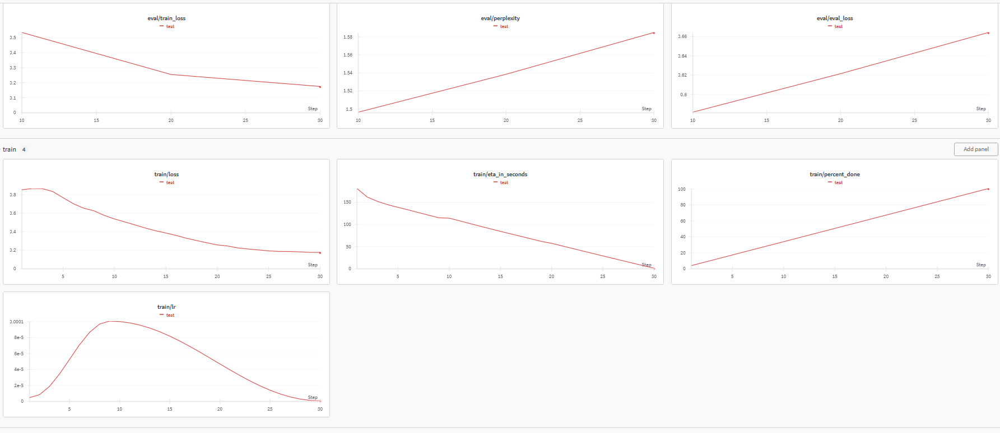

# CritiqueLLM: AI-Powered Startup Idea Evaluation

CritiqueLLM is an advanced AI tool that provides rapid, in-depth analysis of your startup ideas in just 8-12 seconds. Powered by a fine-tuned open-mistral-7b language model, our solution delivers comprehensive insights to help entrepreneurs refine and validate their concepts.

## Key Features

- **Lightning-Fast Analysis**: Get detailed evaluations in seconds, not hours.
- **Holistic Framework**: Our proprietary analysis framework correlates strongly with the renowned SWOT (Strengths, Weaknesses, Opportunities, Threats) methodology developed upon self-discover framework.
- **Three-Dimensional Insight**: Each idea is examined across critical dimensions:
  - Real World Viability & Acuteness
  - Market Potential & Target User Base
  - Required Resources & Capital
- **User Friendly Website**: User Friendly Website built using Flask, Bootstrap, HTML and CSS
  
## Why CritiqueLLM?

- 🚀 **Save Time**: Rapidly iterate through multiple ideas or variations.
- 🔍 **Reduce Bias**: Get an objective, AI-driven perspective on your concept.
- 📊 **Enhance Decision-Making**: Make data-informed choices about which ideas to pursue.
- 💡 **Identify Blind Spots**: Uncover potential challenges or opportunities you might have missed.

## Model Fine-Tuning Process

We employed a rigorous process to fine-tune our model for optimal performance:

1. **Data Collection**: We carefully selected 50 diverse startup ideas from around the world to create a high-quality training dataset.

2. **Initial Analysis**: Multiple high-parameter language models were used to generate initial analyses of these startup ideas.

3. **Human-in-the-Loop Refinement**: Human reviewers evaluated and refined the model outputs, ensuring accuracy and relevance.

4. **Iterative Improvement**: We made continuous tweaks to the process based on human feedback to generate high-quality samples.

5. **Model Selection**: After extensive testing, we chose open-mistral-7b as our base model due to its performance and efficiency.

6. **Fine-Tuning**: The open-mistral-7b model was fine-tuned for 30 steps with a learning rate of 10^-4.

7. **Validation**: Rigorous testing was conducted to ensure the fine-tuned model met our high standards for startup idea analysis.

For a detailed look at our fine-tuning process and to examine the training data, please refer to the `finetuning` folder in this repository. Also check the weights and biases finetuning graphs below.

<p align="center">
  
</p>

## Getting Started

```bash
# Clone the repository
git clone https://github.com/yourusername/CritiqueLLM.git

# Navigate to the project directory
cd CritiqueLLM

# Install dependencies
pip install -r requirements.txt

# Run the application
python app.py
